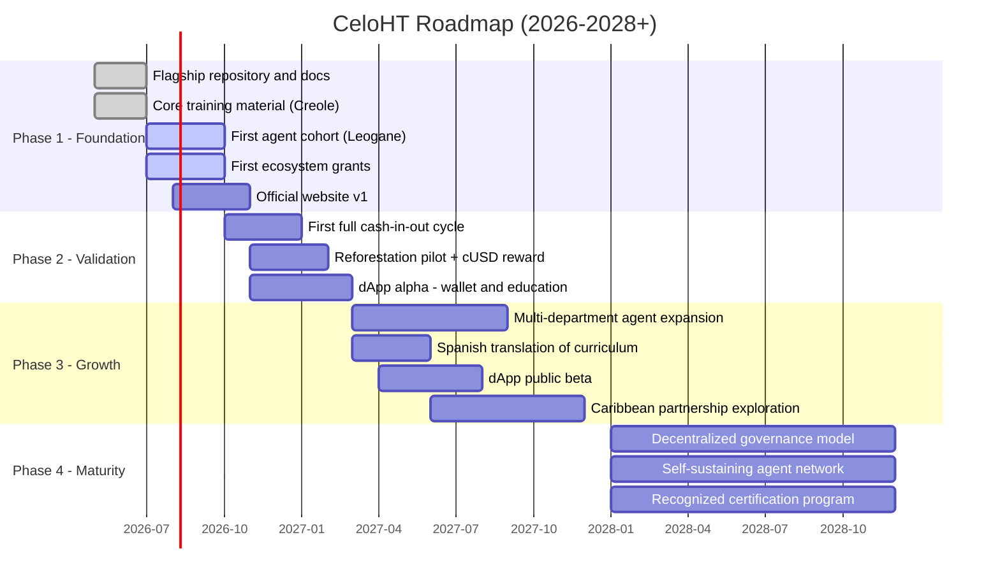
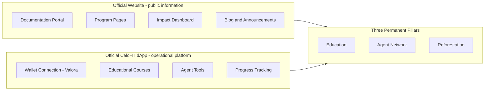

# CeloHT Roadmap

This document is the authoritative roadmap for the CeloHT ecosystem. It
covers our three permanent pillars — **Education**, **Agent Network**, and
**Reforestation** — along with the strategic infrastructure that supports
them: our official website, our official dApp, community growth,
partnerships, governance, the developer ecosystem, transparency, and
long-term financial sustainability.

For a narrative walkthrough of the vision behind this plan, see
[`docs/roadmap.md`](docs/roadmap.md). For the underlying identity and
principles, see [`docs/vision.md`](docs/vision.md) and
[`docs/mission.md`](docs/mission.md).

> **A note on how to read this roadmap.** Dates describe target windows, not
> guarantees. Each phase depends on the previous one being validated —
> we'd rather move a milestone than hit a date with a half-working program.
> Progress against this roadmap is reported publicly through our monthly
> community updates (see
> [`templates/monthly-community-update.md`](templates/monthly-community-update.md))
> and through [`CHANGELOG.md`](CHANGELOG.md).

---

## Table of Contents

- [Guiding Principles](#guiding-principles)
- [Roadmap at a Glance](#roadmap-at-a-glance)
- [Phase 1 — Foundation](#phase-1--foundation-2026-q2q3)
- [Phase 2 — Validation](#phase-2--validation-2026-q4--2027-q1)
- [Phase 3 — Growth](#phase-3--growth-2027)
- [Phase 4 — Maturity](#phase-4--maturity-2028)
- [Strategic Initiative: Official Website](#strategic-initiative-official-website)
- [Strategic Initiative: Official CeloHT dApp](#strategic-initiative-official-celoht-dapp)
- [Strategic Initiative: Community Growth](#strategic-initiative-community-growth)
- [Strategic Initiative: Partnerships](#strategic-initiative-partnerships)
- [Strategic Initiative: Governance](#strategic-initiative-governance)
- [Strategic Initiative: Developer Ecosystem](#strategic-initiative-developer-ecosystem)
- [Strategic Initiative: Transparency & Impact](#strategic-initiative-transparency--impact)
- [Strategic Initiative: Financial Sustainability](#strategic-initiative-financial-sustainability)
- [How the Website and the dApp Relate](#how-the-website-and-the-dapp-relate)
- [Dependencies Between Phases](#dependencies-between-phases)
- [How We Track Progress](#how-we-track-progress)

---

## Guiding Principles

Everything on this roadmap is built on the same non-negotiable facts about
what CeloHT is and isn't. They shape every milestone below:

- CeloHT is a **community-driven, open-source initiative**.
- CeloHT is **not** a blockchain.
- CeloHT does **not** have its own token.
- CeloHT does **not** issue NFTs.
- CeloHT does **not** provide investment products.
- CeloHT is **built on the Celo ecosystem**.
- CeloHT uses **CELO** for network transactions where appropriate.
- CeloHT promotes the use of **cUSD** for accessible digital payments.
- CeloHT develops applications **compatible with the Valora wallet** — CeloHT
  does not own, manage, or operate Valora.

Any roadmap item that would conflict with these principles doesn't belong on
this roadmap, regardless of how attractive it might look. See
[`docs/legal-status.md`](docs/legal-status.md) for the full list of what
CeloHT is not.

## Roadmap at a Glance

---

## Phase 1 — Foundation (2026, Q2–Q3)

**Goal**: establish a credible, transparent base for everything that
follows — documentation, first agents, first partners.

| Milestone | Pillar / Initiative | Status | Target |
|---|---|---|---|
| Publish the official flagship repository | Governance | ✅ Done | 2026-Q3 |
| Core financial & Web3 training material in Haitian Creole | Education | ✅ Done | 2026-Q3 |
| Recruit and train the first cohort of community agents (Léogâne) | Agent Network | 🔄 In progress | 2026-Q3 |
| Land first grants/partnerships within the Celo ecosystem | Partnerships | 🔄 In progress | 2026-Q3 |
| Publish official website v1 (informational) | Official Website | ⏳ Planned | 2026-Q3/Q4 |
| Define reforestation pilot site and partner | Reforestation | ⏳ Planned | 2026-Q3 |

### Success metrics

- 3–5 active, trained community agents
- 100+ people completing at least one core training module
- At least 1 signed grant or partnership agreement
- Website live with documentation, program pages, and contact channels

---

## Phase 2 — Validation (2026 Q4 – 2027 Q1)

**Goal**: prove the model works end-to-end in a single pilot area before
spending resources on expansion.

| Milestone | Pillar / Initiative | Target |
|---|---|---|
| First complete cash-in/cash-out cycle handled entirely by agents | Agent Network | 2026-Q4 |
| First reforestation pilot with cUSD-based rewards | Reforestation | 2027-Q1 |
| dApp alpha: Valora-compatible wallet connection + first education module | Official dApp | 2027-Q1 |
| Systematic collection and public reporting of community feedback | Transparency & Impact | Ongoing |
| Formal agent code of conduct and verification process live | Governance | 2026-Q4 |

### Success metrics

- Stable, repeatable transaction volume through agents (week over week)
- Agent 90-day retention above 70%
- First verified batch of trees planted and photo/geo-tracked
- dApp alpha tested by at least 20 real users with structured feedback

---

## Phase 3 — Growth (2027)

**Goal**: expand beyond the pilot once the operational model is proven, and
move the dApp from alpha to a public beta.

| Milestone | Pillar / Initiative | Target |
|---|---|---|
| Expand agent network across multiple departments in Haiti | Agent Network | 2027-Q2/Q3 |
| Translate core curriculum into Spanish | Education | 2027-Q2 |
| dApp public beta: progress tracking, PDF resources, agent tools | Official dApp | 2027-Q3 |
| Explore early partnerships in other Caribbean countries | Partnerships | 2027-Q4 |
| Publish first annual transparency & impact report | Transparency & Impact | 2027-Q4 |
| Introduce a lightweight, elected community input process | Governance | 2027-Q3 |

### Success metrics

- Agent network active in 3+ departments
- Spanish-language curriculum used in at least one pilot cohort outside Haiti
- dApp public beta with measurable learning-completion rates
- Published, dated impact report covering all three pillars

---

## Phase 4 — Maturity (2028+)

**Goal**: an ecosystem that runs on mature governance and is increasingly
self-sustaining, rather than grant-dependent.

| Milestone | Pillar / Initiative | Target |
|---|---|---|
| Transition toward a more decentralized governance model | Governance | 2028 |
| Agent network reaches meaningful fee-based self-sustainability | Financial Sustainability | 2028 |
| Recognized educational certification program with external partners | Education | 2028 |
| dApp: exploratory smart-contract integrations where they clearly serve the mission | Official dApp | 2028+ |
| Agent network active in multiple Caribbean countries | Agent Network | 2028+ |

### Success metrics

- Governance model formally documented and ratified by the community
- A defined, published share of agent-network operating costs covered by
  service fees rather than grants
- At least one accredited or externally recognized certification pathway
- Reforestation impact reported in cumulative trees planted and verified survival rate

---

## Strategic Initiative: Official Website

The website is CeloHT's **public information platform** — where anyone,
from a first-time visitor to a due-diligence team at a funding
organization, can understand who we are and verify what we say about
ourselves.

### Objectives

- Official website with a clear, accurate description of CeloHT
- A documentation portal (mirroring this repository's `docs/`)
- Community updates and news
- Dedicated program pages for Education, Agent Network, and Reforestation
- A public impact dashboard (trees planted, agents trained, people educated)
- A blog for announcements and longer-form updates
- Multilingual support (Haitian Creole, English, and eventually Spanish)
- Accessibility as a baseline requirement, not an afterthought
- Performance optimization, especially for low-bandwidth mobile connections
  — the same reality that shapes our choice of Celo in the first place

See [`docs/deployment.md`](docs/deployment.md) for current hosting details.

## Strategic Initiative: Official CeloHT dApp

The dApp is CeloHT's **operational digital platform** — where education,
wallet connectivity, and agent tools actually happen.

### Objectives

- Secure wallet connection compatible with **Valora**
- Support for **CELO** and **cUSD** where appropriate to the feature
- Structured educational courses, mirroring our offline curriculum
- Downloadable PDF learning resources for offline / low-connectivity use
- Learning progress tracking per user
- Community participation features (discussion, feedback, local events)
- Dedicated tools for community agents (verification, transaction logging,
  reporting)
- Future smart-contract integrations, added only where they clearly serve
  the mission — not for their own sake

See [`docs/api.md`](docs/api.md) for the current state of technical
integration planning.

## Strategic Initiative: Community Growth

Growth in CeloHT isn't measured only in user counts — it's measured in
trained agents, completed courses, and trees still alive a year after
planting. Community growth work includes:

- Structured onboarding for new community members and agents
- Recurring in-person and virtual training sessions
- Regional community coordinators as the agent network expands
- Feedback loops built into every program, not bolted on afterward

## Strategic Initiative: Partnerships

See [`docs/partnerships.md`](docs/partnerships.md) for our full partnership
strategy. On the roadmap specifically:

- Formalize at least one Celo ecosystem grant relationship in Phase 1
- Establish local NGO/cooperative partnerships ahead of geographic expansion
  in Phase 3
- Explore educational-institution partnerships to embed our curriculum in
  existing programs

## Strategic Initiative: Governance

See [`GOVERNANCE.md`](GOVERNANCE.md) for the current model. Roadmap
commitments:

- Formal agent code of conduct (Phase 2)
- Lightweight elected community input process (Phase 3)
- Transition toward more decentralized governance (Phase 4)

## Strategic Initiative: Developer Ecosystem

See [`docs/developer-guide.md`](docs/developer-guide.md) and
[`CONTRIBUTING.md`](CONTRIBUTING.md). Roadmap commitments:

- Keep this repository as the canonical source of truth as the dApp and
  website repositories are developed
- Publish contribution guidelines specific to dApp development once that
  codebase opens up
- Maintain CI/CD quality gates (CodeQL, dependency review, linting) across
  every CeloHT repository, not just this one

## Strategic Initiative: Transparency & Impact

- Public roadmap (this document), updated at least quarterly
- Monthly community updates (see
  [`templates/monthly-community-update.md`](templates/monthly-community-update.md))
- Annual transparency & impact report starting Phase 3
- Public, verifiable reforestation tracking (photo + geolocation)

## Strategic Initiative: Financial Sustainability

See [`docs/business-model.md`](docs/business-model.md) for the full model.
Roadmap commitments:

- Phase 1–2: funded primarily through grants and partnerships
- Phase 3: introduce reasonable, transparent service fees within the agent
  network to begin reducing grant dependency
- Phase 4: a published target share of operating costs covered by
  self-generated revenue

---

## How the Website and the dApp Relate

It's worth being explicit about this, since the two are easy to conflate:

- **The Website** is the public information platform — it explains who
  CeloHT is, documents our work, and builds trust with visitors, partners,
  and donors.
- **The dApp** is the operational digital platform — it's where a real user
  connects a Valora-compatible wallet, takes a course, and an agent logs a
  transaction.
- **Both exist to strengthen the same three pillars** — Education, Agent
  Network, and Reforestation. Neither is an end in itself.

---

## Dependencies Between Phases

Each phase depends on the one before it being validated. We deliberately
avoid rushing geographic expansion ahead of proving the operational model
works in a single pilot area, and we avoid building deep smart-contract
integrations into the dApp before the basic education-and-wallet experience
is solid.

## How We Track Progress

- ✅ **Done** — shipped and verifiable today
- 🔄 **In progress** — actively being worked on
- ⏳ **Planned** — scoped, not yet started

Progress against this roadmap is reviewed as part of our governance process
(see [`GOVERNANCE.md`](GOVERNANCE.md)) and reflected in
[`CHANGELOG.md`](CHANGELOG.md) as milestones are completed.
