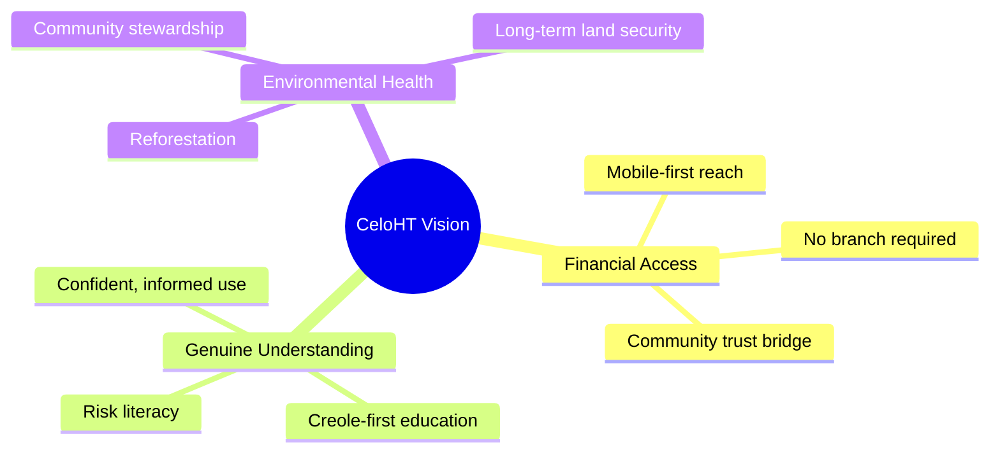
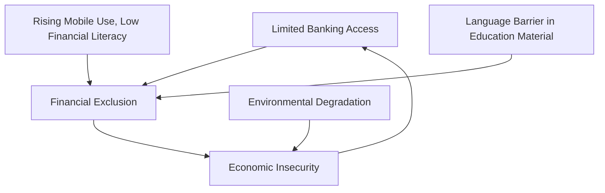
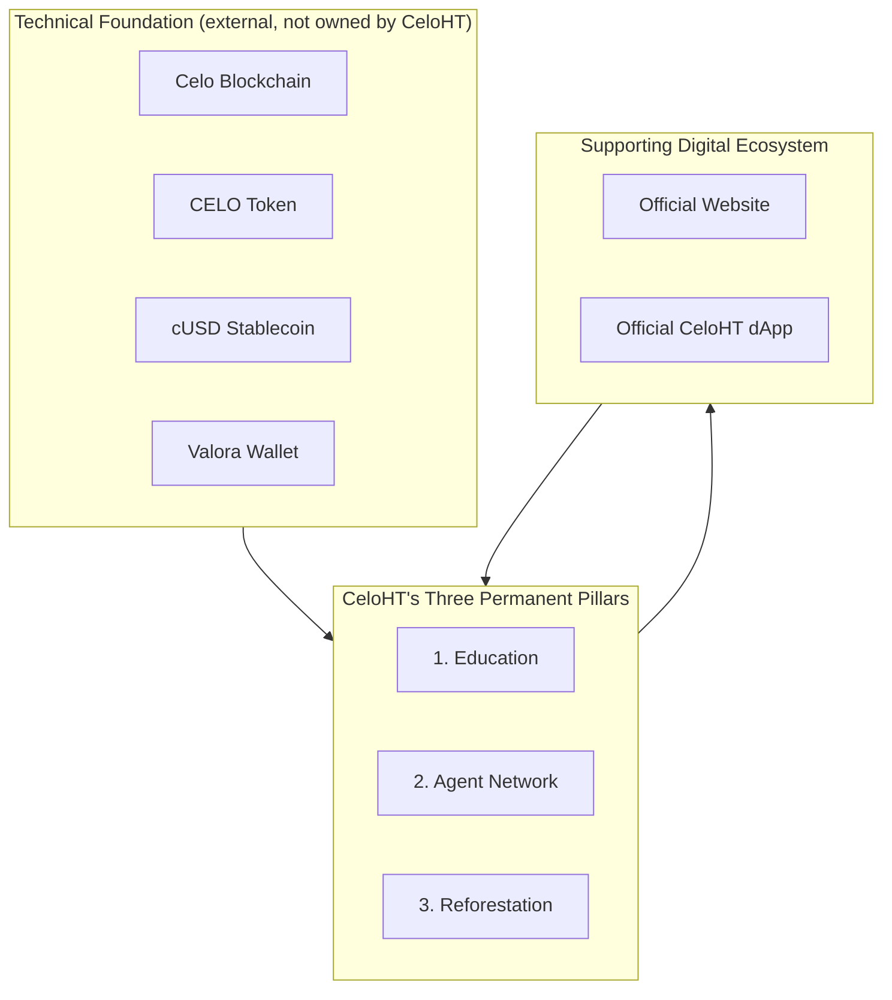
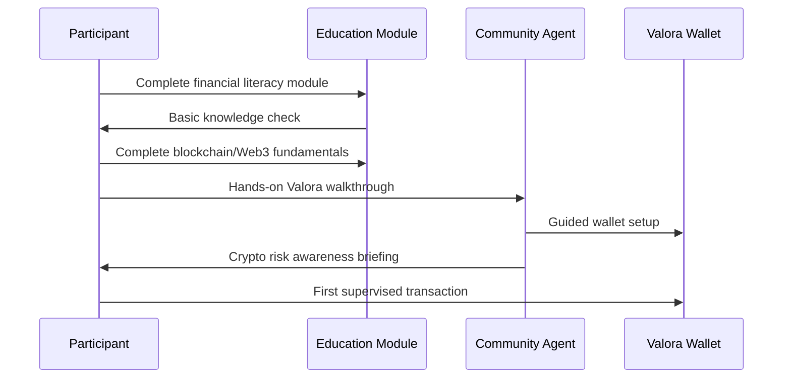
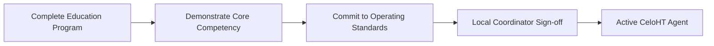
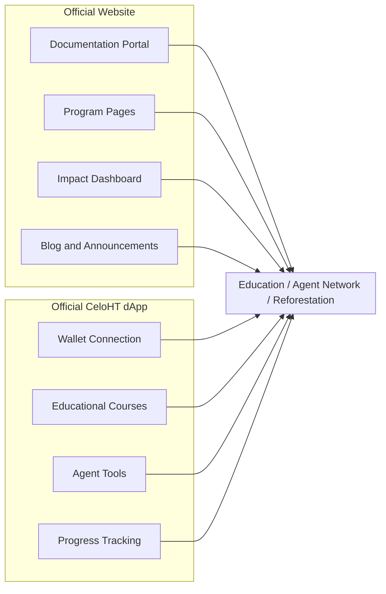
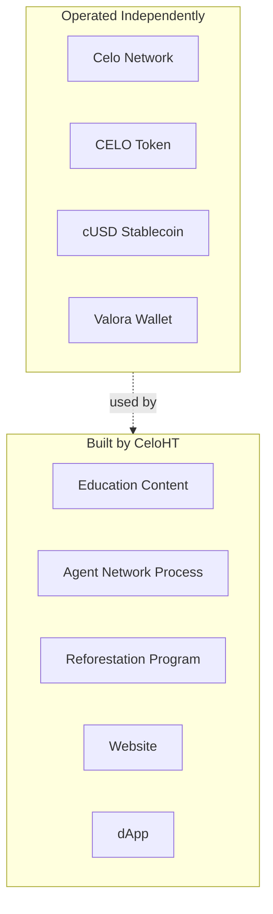
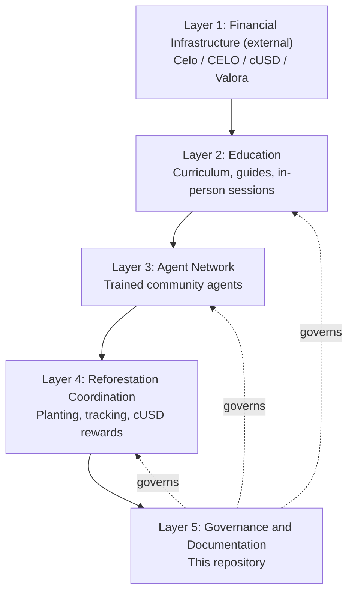
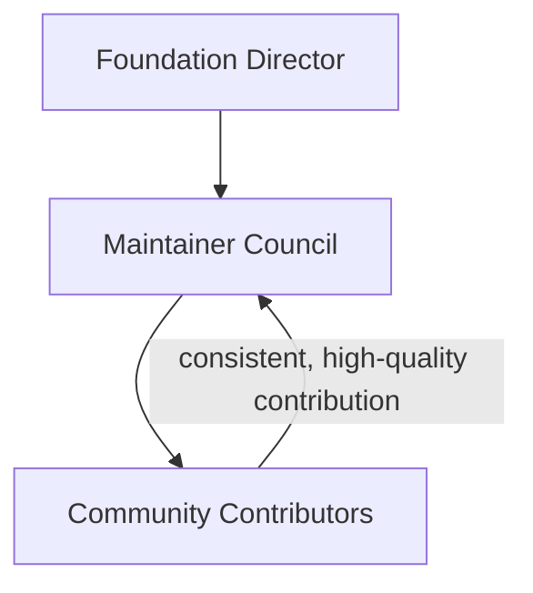
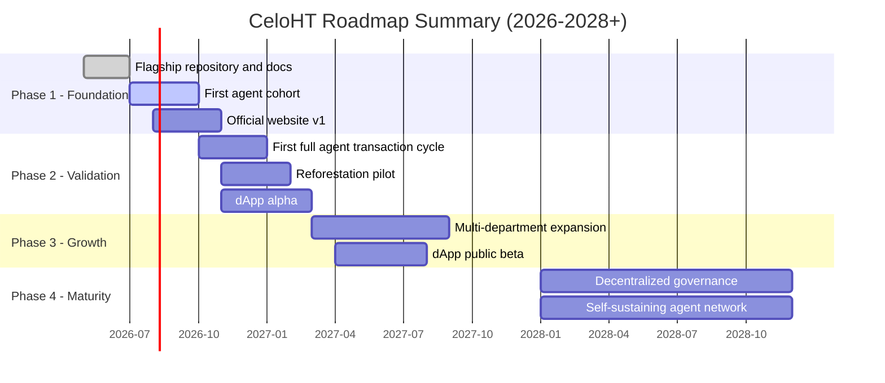

# CeloHT Whitepaper

**A Community-Driven, Open-Source Initiative for Financial Inclusion, Education, and Reforestation on the Celo Ecosystem**

<div align="center">

**Version 1.0**
**Published:** July 2026
**License:** Content licensed for reference; code under [Apache 2.0](LICENSE)
**Maintained by:** CeloHT Contributors [github.com/celo-ht/celoht](https://github.com/celo-ht/celoht)

</div>

---

> **A note on scope before you read further.** This document describes
> CeloHT as it exists and as it plans to grow. CeloHT is a community
> initiative, not a blockchain, not a token, and not an investment vehicle.
> Every technical claim in this paper about Celo, CELO, cUSD, or Valora
> describes how CeloHT *uses* infrastructure that is developed, operated,
> and governed independently by their respective teams. Nothing in this
> document should be read as investment advice, a securities offering, or a
> guarantee of financial return. See [Chapter 4](#4-why-celoht-exists) and
> [Chapter 18](#18-governance) for the full detail on what CeloHT is and is
> not.

---

## Table of Contents

1. [Executive Summary](#1-executive-summary)
2. [Vision](#2-vision)
3. [Mission](#3-mission)
4. [Why CeloHT Exists](#4-why-celoht-exists)
5. [The Challenges](#5-the-challenges)
6. [Our Solution](#6-our-solution)
7. [Core Values](#7-core-values)
8. [Education](#8-education)
9. [Agent Network](#9-agent-network)
10. [Reforestation](#10-reforestation)
11. [Digital Ecosystem](#11-digital-ecosystem)
12. [Official Website](#12-official-website)
13. [Official CeloHT dApp](#13-official-celoht-dapp)
14. [Celo Ecosystem Integration](#14-celo-ecosystem-integration)
15. [CELO and cUSD Usage](#15-celo-and-cusd-usage)
16. [Wallet Compatibility (Valora)](#16-wallet-compatibility-valora)
17. [Technical Architecture](#17-technical-architecture)
18. [Governance](#18-governance)
19. [Open Source Strategy](#19-open-source-strategy)
20. [Security](#20-security)
21. [Privacy](#21-privacy)
22. [Community Participation](#22-community-participation)
23. [Partnerships](#23-partnerships)
24. [Sustainability](#24-sustainability)
25. [Roadmap](#25-roadmap)
26. [Expected Social Impact](#26-expected-social-impact)
27. [Risk Analysis](#27-risk-analysis)
28. [Frequently Asked Questions](#28-frequently-asked-questions)
29. [Future Vision](#29-future-vision)
30. [Conclusion](#30-conclusion)

[Appendix A: Terminology](#appendix-a-terminology)
[Appendix B: Reference Documents](#appendix-b-reference-documents)

---

## 1. Executive Summary

CeloHT is a community-driven, open-source initiative founded in Léogâne,
Haiti, built to expand financial inclusion through three permanent pillars:
**Education**, an **Agent Network**, and **Reforestation**. It is built on
top of the Celo ecosystem using CELO and cUSD where appropriate, and
developing applications compatible with the Valora wallet but CeloHT is
not itself a blockchain, a cryptocurrency, a token, or an investment
platform.

The initiative exists because a large share of Haiti's rural and
semi-rural population has limited access to traditional banking while
mobile phone penetration continues to grow. Rather than treating that gap
as a technology problem alone, CeloHT treats it as an education problem
first, a trust and access problem second, and an environmental problem
third all three connected, none of them optional.

This whitepaper documents CeloHT's vision, mission, and the reasoning
behind its approach; the operational detail behind each of the three
pillars; the digital ecosystem being built to support them (an official
website and an official dApp); the technical and governance architecture
underneath all of it; and the roadmap that connects where CeloHT is today
to where it intends to be by 2028.

Throughout, this document is deliberately conservative in its claims. It
does not promise financial returns, does not describe CeloHT as an
investment, and does not overstate technical capability that hasn't been
built yet. Readers evaluating CeloHT as a partner, funder, contributor, or
community member should treat this whitepaper as a living document,
updated as the initiative matures — not as a static pitch.

### Key facts

| | |
|---|---|
| **Founded** | Léogâne, Haiti |
| **Founder** | Johnny Dubic |
| **Legal nature** | Community-driven, open-source initiative (not a company issuing securities) |
| **Underlying infrastructure** | Celo (blockchain), CELO (token), cUSD (stablecoin), Valora (wallet) |
| **Primary community language** | Haitian Creole |
| **Documentation language** | English |
| **Governance repository** | [github.com/celo-ht/celoht](https://github.com/celo-ht/celoht) |
| **License** | Apache 2.0 |

---

## 2. Vision

CeloHT's long-term vision is a Haiti and, over time, a wider Caribbean
where geographic distance from a bank branch no longer determines whether
someone can save, transact, or transfer money safely. A place where mobile
financial tools are used with genuine understanding rather than blind
trust, and where the pursuit of financial access doesn't come at the
expense of the natural environment communities depend on.

This vision rests on three observations that shaped CeloHT from the start:

1. **Mobile reach already exceeds banking reach** in much of rural Haiti.
   Where a bank branch is hours away, a phone signal often isn't.
2. **Access without understanding is a liability, not a benefit.** Handing
   someone a financial tool they don't understand creates new risks
   scams, mismanagement, loss of funds instead of solving old ones.
3. **Financial development and environmental health are not separate
   tracks.** Communities whose economic security depends on land and
   agriculture cannot be served by an initiative that ignores deforestation.

By 2030, CeloHT aims to have measurably shifted these three realities in
the communities it serves not through a single large deployment, but
through a growing network of trained agents, educated participants, and
verified reforestation activity, expanding one validated region at a time.



See [Chapter 3](#3-mission) for how this vision translates into an
operating mission, and [Chapter 25](#25-roadmap) for the phased plan.

---

## 3. Mission

**CeloHT's mission is to expand financial inclusion through education, a
decentralized network of community agents, and environmental reforestation
built on the Celo ecosystem as its technical foundation.**

This mission statement is deliberately ordered. Education is named first
because CeloHT treats it as a prerequisite, not a companion feature. The
agent network is named second because human trust, not app design alone,
is what makes financial tools usable in communities with low prior exposure
to digital finance. Reforestation is named third not because it matters
less, but because it is the pillar most directly tied to the long-term
economic security of the same communities the first two pillars serve.

### Mission in Practice

| Mission Component | What It Looks Like Operationally |
|---|---|
| Education | Creole-language curriculum covering financial literacy, blockchain/Web3 fundamentals, and hands-on Valora/cUSD use, delivered before any tool is introduced |
| Agent Network | Trained community members who facilitate cash-in/cash-out, transfers, and local support |
| Reforestation | Coordinated tree-planting tied to verified activity and rewarded through cUSD |
| Technical Foundation | Celo, CELO, cUSD, and Valora-compatible tooling used, not owned, by CeloHT |

### Who the Mission Serves

CeloHT's primary audience is rural and semi-rural Haitian communities with
limited traditional banking access and growing mobile phone use. As the
agent network and curriculum mature, the mission extends to other
Caribbean communities facing a comparable combination of limited banking
infrastructure and rising mobile connectivity.

---

## 4. Why CeloHT Exists

CeloHT exists because financial inclusion efforts often fail at the last
mile not because the technology doesn't work, but because it arrives
without the trust, language, and understanding a community needs to use it
safely. Haiti, like many countries with large unbanked and underbanked
populations, has seen fintech and crypto projects come and go, frequently
built by outsiders, rarely explained in the language people actually speak,
and almost never accompanied by a real, sustained education effort.

CeloHT was built as a direct, deliberate correction to that pattern:

- **Built from within the community it serves**, starting in Léogâne, not
  designed elsewhere and deployed onto Haiti.
- **Education-first, not app-first.** Every program begins with a
  curriculum, not a download link.
- **Explicit about what it is not.** CeloHT does not describe itself as a
  blockchain, a token, or an investment, because doing so would be both
  legally irresponsible and a disservice to a population that has,
  historically, been targeted by exactly those kinds of misrepresentations.

### What CeloHT Is

> A community-driven, open-source initiative built on the Celo ecosystem,
> organized around three permanent pillars: Education, Agent Network, and
> Reforestation.

### What CeloHT Is Not

| CeloHT is NOT | Why This Distinction Matters |
|---|---|
| A blockchain | CeloHT builds on Celo; it does not operate, fork, or govern a blockchain of its own |
| A cryptocurrency or token | CeloHT has no native token and does not plan to issue one |
| An ICO or IDO | CeloHT has never conducted, and will not conduct, a token sale |
| An NFT project | CeloHT does not issue or trade NFTs |
| A staking platform | CeloHT does not offer staking products or yield |
| An investment platform | CeloHT makes no promises of financial return |
| A DeFi protocol | CeloHT does not operate lending, liquidity, or yield-generating smart contracts |
| An owner or operator of Valora | CeloHT builds *compatible* tools; Valora is developed and operated independently |

This distinction is not a legal formality it is central to how CeloHT
designs every program, writes every piece of documentation, and trains every
agent. See [Chapter 20](#20-security) and [`docs/legal-status.md`](docs/legal-status.md)
for how this principle is enforced in practice.

---

## 5. The Challenges

CeloHT is built around four interlocking challenges observed directly in
the communities it serves.

### 5.1 Limited Traditional Banking Access

Bank branches are concentrated in urban centers. For a significant share of
rural and semi-rural households, reaching a branch means real travel time
and cost often more than the transaction itself is worth.

### 5.2 Rising Mobile Connectivity Without Matching Financial Literacy

Mobile phone and mobile data use continues to grow faster than formal
financial education. This creates a dangerous gap: the technical means to
access digital financial tools exists well before the knowledge to use
them safely does.

### 5.3 Language as a Barrier, Not Just a Detail

Most financial and blockchain education material available today is
written in English or French, not Haitian Creole the language most
Haitians actually think and transact in. A translated afterthought is not
the same as material designed in the language from the start.

### 5.4 Environmental Degradation Tied to Economic Insecurity

Deforestation in Haiti is both a cause and a symptom of economic pressure
on rural communities. An initiative focused only on financial access, while
ignoring the land communities depend on, addresses only part of the
problem.



These four challenges reinforce each other, which is why CeloHT treats them
as a single interconnected problem rather than four separate initiatives.

---

## 6. Our Solution

CeloHT's response to these challenges is structured around three permanent
pillars, supported by a growing digital ecosystem.



Each pillar is described in full detail in Chapters 8 through 10. The
supporting digital ecosystem the official website and dApp is covered
in Chapters 11 through 13. What matters at a summary level is this: CeloHT
does not treat any single pillar, or any single piece of software, as the
solution on its own. The solution is the combination, applied consistently,
over time, in one validated community before the next.

---

## 7. Core Values

| Value | What It Means in Practice |
|---|---|
| **Language access first** | Haitian Creole is the primary language for educational material — not a translation added afterward |
| **Radical transparency** | Governance, decisions, and processes are documented publicly in this repository |
| **Community first** | Programs are built *with* the community, not designed elsewhere and deployed onto it |
| **Technology as a tool, not the goal** | Celo, cUSD, and Valora are means to an end; they are never promoted for their own sake |
| **Environmental sustainability** | Economic growth and environmental health are treated as one goal, not two competing ones |
| **Financial honesty** | CeloHT never promises returns and never gives personal financial advice |
| **Continuous learning** | Programs are adjusted based on what actually works in the field, not on what looks good on paper |

These values are not aspirational language they are enforced through
concrete mechanisms: mandatory review of financial claims in documentation
(see [`CODEOWNERS`](CODEOWNERS)), a public governance process, and an
explicit "what CeloHT is not" statement repeated throughout this document
and the repository.

---

## 8. Education

Education is the entry point to every CeloHT program. No participant is
introduced to a wallet, a stablecoin, or an agent transaction without first
completing or at minimum starting the relevant education module.

### 8.1 Curriculum Structure

| Module | Focus | Delivered Before |
|---|---|---|
| Basic Financial Literacy | Budgeting, saving, risk management, the concept of interest | Any wallet setup |
| Blockchain & Web3 Fundamentals | What a blockchain is, how a transaction works, in plain language | Wallet setup |
| Hands-On Valora/cUSD Use | Step-by-step guided use, with heavy emphasis on seed-phrase security | First live transaction |
| Crypto Risk Awareness | Volatility, common scams, and the rule of never risking more than you can afford to lose | Ongoing, reinforced regularly |

### 8.2 Delivery Format

Material is delivered through written guides, visual diagrams, and
in-person community sessions deliberately not confined to a single
digital channel, since not every participant has reliable connectivity at
the point they need the material most.

### 8.3 Measuring Effectiveness

CeloHT tracks three things per cohort: completion rate, pass rate on a
basic knowledge check, and structured post-session feedback. These metrics
feed directly into the [Transparency & Impact](#26-expected-social-impact)
reporting described later in this document.



---

## 9. Agent Network

The agent network is CeloHT's answer to a simple problem: an app alone
does not build trust. A trained person in the community does.

### 9.1 What a CeloHT Agent Does

A CeloHT agent is a community member who has completed the education
program and who:

1. Facilitates cash-to-cUSD and cUSD-to-cash exchanges (cash-in/cash-out)
2. Helps new participants set up and understand Valora
3. Handles peer-to-peer transfer support
4. Acts as a local point of contact for ongoing questions

### 9.2 Operating Standards

| Standard | Requirement |
|---|---|
| Fee transparency | Any fee must be disclosed clearly before a transaction |
| Identity verification | A lightweight process adapted to local context, focused on fraud reduction without creating unreasonable barriers |
| Ongoing training | Regular refresher sessions, not a one-time certification |
| Code of conduct | Agents commit to specific standards protecting users from exploitation |

### 9.3 Becoming an Agent



### 9.4 Connection to Reforestation

A meaningful share of active agents also take on responsibility for
coordinating local reforestation activity see Chapter 10 - creating a
direct operational link between CeloHT's financial and environmental work,
rather than running them as separate programs with separate staff.

---

## 10. Reforestation

Reforestation is a permanent pillar, not a side initiative funded when
convenient. It exists because the same communities CeloHT serves
financially are often the ones most exposed to the economic consequences of
deforestation.

### 10.1 Program Structure

- **Agent-coordinated planting**: the same trained agents who handle
  financial transactions often coordinate local tree-planting activity.
- **Environmental education**: modules covering why trees matter, basic
  planting technique, and long-term care following the same
  education-first principle as the financial curriculum.
- **cUSD rewards**: participants who commit to verified planting and
  tracking activity can receive symbolic rewards in cUSD, directly linking
  environmental action to financial inclusion.
- **Verification and tracking**: basic photo and geolocation documentation,
  with periodic public reporting.

### 10.2 Why cUSD, Specifically

cUSD's price stability makes it a more practical reward mechanism than a
volatile asset a participant who plants and tracks trees over several
months shouldn't see the value of their reward swing unpredictably in the
meantime.

### 10.3 Principles Governing the Program

1. Every reward is tied to a verifiable action — CeloHT does not distribute
   cUSD without structure.
2. The program builds on existing local agricultural knowledge instead of
   importing an external model without adaptation.
3. Success is measured by long-term survival rate, not initial planting
   count alone.

### 10.4 Current Status

As of this writing, the reforestation program is in its design and pilot
phase, with a full pilot targeted for Phase 2 of the roadmap (see
[Chapter 25](#25-roadmap)).

---

## 11. Digital Ecosystem

CeloHT's digital ecosystem consists of two distinct platforms that work
together but serve different purposes: an **official website** and an
**official CeloHT dApp**. Understanding the difference between them matters,
because they are built, governed, and evaluated differently.

| | Official Website | Official CeloHT dApp |
|---|---|---|
| **Purpose** | Public information platform | Operational digital platform |
| **Primary audience** | Visitors, partners, donors, press, general public | Participants, agents, active community members |
| **Core function** | Explain who CeloHT is and document its work | Deliver education, wallet connectivity, and agent tools |
| **Wallet interaction** | None | Valora-compatible connection |
| **Content type** | Documentation, program pages, news, impact dashboard | Courses, progress tracking, agent tools |

Both platforms exist to strengthen the same three pillars Education,
Agent Network, and Reforestation and neither is designed as an end in
itself. See [Chapter 25](#25-roadmap) for their build timeline.



---

## 12. Official Website

The official website (`celoht.com`, with documentation mirrored at
`docs.celoht.com`) is the first point of contact for most people evaluating
CeloHT a journalist researching a story, a funding organization doing
due diligence, or a community member trying to understand what CeloHT
actually is before trusting an agent.

### 12.1 Objectives

- **Official website**: an accurate, jargon-light description of CeloHT and
  its three pillars
- **Documentation portal**: a public mirror of this repository's `docs/`
  directory, kept in sync automatically
- **Community updates**: recurring, dated posts on program progress
- **Program pages**: dedicated pages for Education, Agent Network, and
  Reforestation, each with current status and metrics
- **Impact dashboard**: a public, numbers-first view of trees planted,
  agents trained, and people educated
- **Blog & announcements**: longer-form updates, partnership news, and
  milestone write-ups
- **Multilingual support**: Haitian Creole, English, and — as the Caribbean
  expansion progresses — Spanish
- **Accessibility**: a baseline requirement in design and development, not
  a post-launch fix
- **Performance optimization**: built with low-bandwidth mobile users in
  mind, consistent with the mobile-first reasoning behind choosing Celo in
  the first place

### 12.2 Relationship to This Repository

This GitHub repository remains the canonical source of truth for
governance, policy, and detailed documentation. The website's documentation
portal is a public-facing mirror, not a separate or competing source.

---

## 13. Official CeloHT dApp

The official CeloHT dApp is where the mission becomes operational: where a
participant connects a Valora-compatible wallet, completes a course, and an
agent logs a transaction.

### 13.1 Objectives

- **Compatibility with the Valora wallet** - the dApp does not replace
  Valora; it connects to it
- **CELO and cUSD support where appropriate** - used for the specific
  functions each token is suited to, not interchangeably
- **Educational courses** - a digital mirror of the offline curriculum
  described in Chapter 8
- **Downloadable PDF learning resources** - for offline or low-connectivity
  use, consistent with the realities described in Chapter 5
- **Learning progress tracking** - per-user completion and assessment history
- **Community participation** - discussion, feedback channels, and local
  event coordination
- **Agent tools** - verification, transaction logging, and reporting
  features specific to active agents
- **Future smart-contract integrations** - added only where they clearly
  serve the mission, evaluated case by case, never for their own sake
- **Secure wallet connection** - built to established wallet-connection
  security practice, not a custom, unaudited scheme

### 13.2 What the dApp Is Not

Consistent with [Chapter 4](#4-why-celoht-exists), the dApp will not
include staking products, yield products, a native token, or NFT features.
Any smart-contract integration considered in later phases will be evaluated
against that same standard before it is built.

### 13.3 Development Approach

The dApp will be developed in the open, following the same standards
already in place in this repository public issue tracking, CI/CD quality
gates, and security review once its dedicated repository is established.
See [Chapter 19](#19-open-source-strategy).

---

## 14. Celo Ecosystem Integration

CeloHT is built *on* Celo, not as a fork, sidechain, or competing network.
Celo was chosen specifically because of design characteristics that match
the realities described in Chapter 5.

### 14.1 Why Celo

| Celo Characteristic | Why It Matters for CeloHT |
|---|---|
| Mobile-first design | Matches the mobile-heavy, bank-light reality of CeloHT's target communities |
| Low transaction fees | Keeps small, everyday transactions economically viable |
| EVM compatibility | Gives future dApp development access to a mature tooling ecosystem |
| Proof-of-Stake consensus | Lower energy footprint, consistent with CeloHT's environmental pillar |
| Established stablecoin infrastructure (cUSD) | Removes the volatility problem for everyday use |

### 14.2 What CeloHT Does Not Control

CeloHT does not operate Celo nodes, does not participate in Celo protocol
governance on behalf of its users, and has no authority over the Celo
network's technical roadmap. CeloHT is a *user* of Celo's public
infrastructure, in the same sense that a business is a user of the internet
— present on it, dependent on it working, but not in control of it.



---

## 15. CELO and cUSD Usage

CeloHT uses two distinct assets from the Celo ecosystem, each for a
specific purpose. Neither is issued, minted, or controlled by CeloHT.

### 15.1 CELO

CELO is Celo's native token, used within the protocol for transaction fees
and governance. CeloHT's education material explains what CELO is and how
it functions within the network, and the dApp uses CELO for network
transactions where appropriate to a given feature but CELO is not
positioned as a CeloHT product, reward, or investment.

### 15.2 cUSD

cUSD, a stablecoin pegged to the US dollar, is the asset CeloHT actively
promotes for everyday, accessible digital payments — agent transactions,
reforestation rewards, and any other everyday use case where price
stability matters more than anything else. cUSD's peg is what makes it
usable for a participant who cannot afford to absorb volatility on a small
balance.

### 15.3 Comparison

| | CELO | cUSD |
|---|---|---|
| Type | Native network token | US dollar-pegged stablecoin |
| Volatility | Market-driven | Designed to remain stable |
| CeloHT's primary use | Network transaction fees where appropriate | Everyday payments, agent transactions, reforestation rewards |
| Positioned as a reward? | No | Yes, for verified reforestation activity |
| Issued by CeloHT? | No | No |

---

## 16. Wallet Compatibility (Valora)

Valora is the mobile wallet CeloHT recommends across its training material
and builds its dApp to be compatible with. This section exists specifically
to be unambiguous about the nature of that relationship.

### 16.1 The Relationship, Stated Plainly

**CeloHT does not own, manage, operate, or control Valora.** Valora is
developed and operated by its own team, independently of CeloHT. CeloHT
builds educational content and application features that are compatible
with Valora, in the same way a business might build a website compatible
with a particular web browser, without owning that browser.

### 16.2 Why Valora

Valora was chosen because it's designed for simplicity letting a user
send and receive cUSD and CELO without needing to understand the full
technical stack underneath. That design goal aligns directly with CeloHT's
education-first approach: a wallet interface that doesn't require deep
technical literacy to use safely.

### 16.3 What CeloHT Builds Around Valora

- Step-by-step, Creole-language guidance for Valora setup and use
- Security-focused training on seed-phrase protection specific to Valora's
  interface
- A dApp designed to connect securely to a user's existing Valora wallet,
  not to replace it

### 16.4 If Valora's Availability Changes

Because CeloHT does not control Valora, any material change to its
availability, terms, or functionality is treated as an external dependency
risk see [Chapter 27](#27-risk-analysis) and would be addressed through
CeloHT's governance process described in Chapter 18.

---

## 17. Technical Architecture

CeloHT's architecture is best understood in five layers, moving from
external infrastructure CeloHT depends on but does not control, up to the
governance layer that ties everything together.



### 17.1 Layer Descriptions

| Layer | Owned/Operated By | Description |
|---|---|---|
| 1. Financial Infrastructure | External (Celo, Valora teams) | The public blockchain, token, stablecoin, and wallet CeloHT builds on |
| 2. Education | CeloHT | Curriculum and training material |
| 3. Agent Network | CeloHT | Trained community members handling local financial access |
| 4. Reforestation Coordination | CeloHT | Planting programs tied to verified activity and cUSD rewards |
| 5. Governance & Documentation | CeloHT community | This repository, serving as the source of truth |

### 17.2 Repository Structure

This repository (the flagship governance and documentation hub) is
organized as follows:

```text
celoht/
├── .github/          # CI/CD workflows, issue/PR templates, Dependabot
├── assets/branding/  # Official logo and visual identity
├── docs/             # Full documentation set
├── examples/         # Reference code and usage examples
├── scripts/          # Validation and automation tooling
├── templates/        # Reusable communication templates
├── tools/            # Linting and link-checking configuration
├── ROADMAP.md         # This ecosystem's authoritative roadmap
└── WHITEPAPER.md       # This document
```

### 17.3 Future Repositories

As the website and dApp move from planning to development, each will live
in its own dedicated repository, following the same documentation,
security, and CI/CD standards established here. This flagship repository
will continue to serve as the canonical governance source across all of
them.

---

## 18. Governance

CeloHT is governed by a structure designed to balance clear accountability
today with a credible path toward more decentralized community governance
over time.

### 18.1 Structure



| Role | Responsibility |
|---|---|
| Foundation Director | Strategic vision, external representation, final call in a genuine deadlock |
| Maintainer Council | Technical review, PR approval, day-to-day repository management |
| Community Contributors | Issues, Pull Requests, Discussions the entry point to the Maintainer Council |

### 18.2 Decision-Making

- **Minor changes** (typo fixes, documentation clarity): approved by any
  maintainer after standard review.
- **Major changes** (structural changes, policy shifts, brand changes):
  require Maintainer Council consensus, discussed publicly first.
- **Governance changes** (edits to `GOVERNANCE.md` itself): require a
  minimum 14-day public comment period and majority Council approval.

### 18.3 Roadmap Toward Decentralization

As described in [Chapter 25](#25-roadmap), CeloHT's governance model is
designed to evolve — starting with a lightweight elected community input
process in Phase 3, moving toward a more formally decentralized model in
Phase 4. This is a deliberate, staged transition rather than a promise with
no mechanism behind it; see [`GOVERNANCE.md`](GOVERNANCE.md) for the current
binding policy.

---

## 19. Open Source Strategy

CeloHT operates fully in the open. This repository code, documentation,
governance policy, and roadmap is published under the Apache 2.0 License
and maintained publicly on GitHub.

### 19.1 Why Open Source

- **Trust**: an organization asking communities to trust it with financial
  education should be auditable, not opaque.
- **Reusability**: other community initiatives facing similar challenges
  can learn from or adapt CeloHT's approach.
- **Accountability**: public issue tracking and pull request history create
  a durable record of decisions.

### 19.2 What's Open Today

- This governance and documentation repository, in full
- All GitHub Actions workflows used for repository quality control
- Educational content structure and examples

### 19.3 What's Planned to Open as It's Built

- The official website codebase
- The official CeloHT dApp codebase, including its wallet-connection layer

### 19.4 Contribution Standards

All contributions code or documentation go through Pull Request review,
automated validation (Markdown linting, link checking, YAML/JSON validation),
and, where relevant, CODEOWNERS-mandated review by a domain-specific
maintainer. See [`CONTRIBUTING.md`](CONTRIBUTING.md) for the full process.

---

## 20. Security

CeloHT's security approach operates across three distinct areas: the
repository itself, the education that protects end users, and the agent
network that handles real transactions.

### 20.1 Repository Security

| Control | Purpose |
|---|---|
| CodeQL analysis | Static analysis for code-level vulnerabilities |
| Gitleaks secret scanning | Detects accidentally committed credentials |
| Dependency review | Flags high-severity vulnerable dependencies on every PR |
| CODEOWNERS-mandated review | Requires domain-expert sign-off on sensitive paths |

### 20.2 Educational Security

Security awareness is embedded directly into the curriculum described in
Chapter 8  seed-phrase protection, scam recognition, and a standing rule
that CeloHT will never ask for a user's seed phrase, private key, or wallet
password, under any circumstance.

### 20.3 Agent Network Security

Agents operate under a code of conduct and a lightweight identity
verification process (Chapter 9), designed to protect the end users they
serve without creating barriers so high that legitimate community members
can't participate.

### 20.4 Incident Response

CeloHT classifies incidents by severity Critical, High, Medium, Low and
follows a defined response process: detection, confirmation, containment,
communication, resolution, and public post-incident review where possible.
Full detail is documented in [`docs/incident-response.md`](docs/incident-response.md)
and [`docs/threat-model.md`](docs/threat-model.md).

### 20.5 Reporting a Vulnerability

Security issues should never be reported through public GitHub Issues.
Report privately to **security@celoht.com** or through GitHub Security
Advisories. Full policy: [`SECURITY.md`](SECURITY.md).

### 20.6 Out of Scope

The security of the Celo protocol itself and of the Valora application are
the responsibility of their respective independent teams, not CeloHT.

---

## 21. Privacy

CeloHT collects the minimum information necessary to operate its programs,
and is explicit about what that means at each layer of the ecosystem.

### 21.1 This Repository

This repository does not collect personal data directly. Information
shared in Issues, Pull Requests, or Discussions is publicly visible and
governed by GitHub's own privacy policy.

### 21.2 Agent Onboarding

Agent onboarding may collect basic identity-verification information for
security and compliance purposes. As the agent program matures
operationally, detailed handling, storage, and retention practices will be
published in a dedicated policy document.

### 21.3 Principles

| Principle | In Practice |
|---|---|
| Minimization | Only necessary information is collected |
| Transparency | Users are told what's collected and why |
| Security | Sensitive information is access-controlled |
| No data sales | CeloHT does not sell personal data to third parties |

Full policy: [`docs/privacy.md`](docs/privacy.md). Privacy questions:
privacy@celoht.com.

---

## 22. Community Participation

CeloHT's growth strategy treats community participation as infrastructure,
not marketing.

### 22.1 Ways to Participate

| Path | Entry Point |
|---|---|
| Take a course | Community education sessions (and eventually the dApp) |
| Become an agent | Complete education, demonstrate competency, get coordinator sign-off |
| Contribute to this repository | Documentation, examples, tooling see `CONTRIBUTING.md` |
| Join community discussion | GitHub Discussions, social channels |
| Propose an idea | Discussion templates for ideas and questions |

### 22.2 Feedback Loops

Every education session and agent interaction feeds structured feedback
back into the program design see [Chapter 26](#26-expected-social-impact)
for how this connects to public impact reporting.

### 22.3 Recognition

Contributors who show sustained, high-quality involvement are eligible for
nomination to the Maintainer Council, as described in
[`docs/maintainers.md`](docs/maintainers.md).

---

## 23. Partnerships

CeloHT's approach to partnerships mirrors its approach to everything else:
transparent about what it offers, and specific about what it needs.

### 23.1 Partnership Categories

| Category | Example | What CeloHT Offers |
|---|---|---|
| Celo ecosystem | Celo Foundation grant programs | An active, documented use case for ecosystem funding |
| Local Haitian organizations | NGOs, cooperatives | A trained agent network and education program ready to integrate |
| Educational institutions | Schools, training centers | A ready-made financial/Web3 curriculum in Haitian Creole |
| Environmental partners | Existing reforestation or agriculture organizations | A financial incentive layer (cUSD rewards) tied to verified activity |

### 23.2 What CeloHT Brings

- An engaged, growing community and agent network
- Culturally and linguistically adapted training material
- Full transparency through this public repository
- A documented track record of shipping real content and programs

### 23.3 Getting in Touch

partnerships@celoht.com see [`docs/partnerships.md`](docs/partnerships.md)
for the full strategy and [`docs/business-model.md`](docs/business-model.md)
for the economic context behind any partnership conversation.

---

## 24. Sustainability

Sustainability, for CeloHT, applies in two directions: financial and
environmental. Both are treated as design requirements, not aspirations.

### 24.1 Financial Sustainability

CeloHT is a **nonprofit-style, community-governed initiative** - not a
company issuing equity or promising returns. Its funding model has three
components:

1. **Ecosystem grants** - primarily from Celo Foundation and aligned programs
2. **Strategic partnerships** - funding tied to specific projects (e.g., a
   dedicated reforestation grant)
3. **Community contributions** - voluntary support through channels like
   GitHub Sponsors

Over time, the goal is to reduce dependence on grants through reasonable,
transparent service fees within the agent network targeted to begin in
Phase 3 of the roadmap and formalized in Phase 4. See
[`docs/business-model.md`](docs/business-model.md).

### 24.2 Environmental Sustainability

Reforestation (Chapter 10) is CeloHT's direct environmental sustainability
mechanism, but sustainability thinking also shapes technical choices for
example, favoring Celo's Proof-of-Stake consensus, which carries a far
lower energy footprint than Proof-of-Work alternatives.

### 24.3 Organizational Sustainability

Long-term organizational sustainability depends on the governance
transition described in Chapter 18 moving from a founder-centered
structure to a Maintainer Council and, eventually, a more decentralized
model capable of outlasting any single individual's involvement.

---

## 25. Roadmap

This chapter summarizes CeloHT's phased roadmap. The authoritative,
continuously updated version lives in [`ROADMAP.md`](ROADMAP.md) at the
repository root this section is a snapshot as of publication.

### 25.1 Phase Overview



### 25.2 Phase Summary Table

| Phase | Window | Primary Goal |
|---|---|---|
| 1. Foundation | 2026 Q2–Q3 | Establish a credible base: documentation, first agents, first partners |
| 2. Validation | 2026 Q4 – 2027 Q1 | Prove the model end-to-end in a single pilot area |
| 3. Growth | 2027 | Expand beyond the pilot; move the dApp to public beta |
| 4. Maturity | 2028+ | Mature governance and financial self-sustainability |

### 25.3 Strategic Initiatives Supporting All Phases

- Official Website (Chapter 12)
- Official CeloHT dApp (Chapter 13)
- Community Growth
- Partnerships (Chapter 23)
- Governance (Chapter 18)
- Developer Ecosystem (Chapter 19)
- Transparency & Impact (Chapter 26)
- Financial Sustainability (Chapter 24)

For full milestone tables, success metrics, and dependency notes for each
phase, see [`ROADMAP.md`](ROADMAP.md).

---

## 26. Expected Social Impact

CeloHT measures impact in concrete, verifiable terms rather than broad
claims. The metrics below are the ones tracked today or planned for
near-term tracking as programs scale.

### 26.1 Education Impact

| Metric | What It Measures |
|---|---|
| Module completion count | People who finish at least one training module |
| Knowledge-check pass rate | Whether training is actually landing |
| Post-session feedback | Qualitative signal on relevance and clarity |

### 26.2 Agent Network Impact

| Metric | What It Measures |
|---|---|
| Active trained agents | Network capacity |
| Transaction volume through agents | Real usage, not just registrations |
| 90-day agent retention | Whether the role is sustainable for agents themselves |

### 26.3 Reforestation Impact

| Metric | What It Measures |
|---|---|
| Trees planted (verified) | Direct environmental output |
| Tree survival rate over time | Whether planting translates into lasting impact |
| Participants rewarded | Reach of the financial-environmental link |

### 26.4 Public Reporting

Starting in Phase 3, CeloHT commits to an annual transparency and impact
report covering all three pillars, in addition to the recurring monthly
community updates already in place. See
[`templates/monthly-community-update.md`](templates/monthly-community-update.md).

---

## 27. Risk Analysis

CeloHT operates with real, acknowledged risks. This section names them
directly rather than minimizing them.

| Risk | Category | Mitigation |
|---|---|---|
| Impersonation / phishing using the CeloHT name | Security | Clearly documented official channels; explicit "we never ask for your seed phrase" messaging (Chapter 20) |
| Dependence on Celo network availability and performance | Technical / External | CeloHT does not control Celo; monitored as an external dependency |
| Dependence on Valora's continued availability | Technical / External | CeloHT does not own Valora; any material change is treated as a dependency risk (Chapter 16) |
| Misleading financial claims by bad-faith contributors | Governance / Reputational | CODEOWNERS-mandated review on sensitive documentation paths |
| Agent misconduct or fraud | Operational | Code of conduct, identity verification, ongoing training (Chapter 9) |
| Reforestation activity claimed but not delivered | Operational | Photo and geolocation verification before rewards are issued |
| Funding concentration in grants | Financial | Phased introduction of service-fee revenue starting Phase 3 (Chapter 24) |
| Regulatory misclassification (being mistaken for a financial product) | Legal | Explicit, repeated "what CeloHT is not" statements across all documentation (Chapter 4) |

CeloHT does not claim these risks are eliminated — only that they are
identified, monitored, and addressed through specific, named mechanisms
rather than left implicit.

---

## 28. Frequently Asked Questions

**Is CeloHT a cryptocurrency or a token?**
No. CeloHT uses Celo ecosystem infrastructure (CELO, cUSD) but is not
itself a token or blockchain.

**Can I invest in CeloHT?**
No. CeloHT offers no investment product of any kind.

**Does CeloHT own or operate Valora?**
No. CeloHT builds compatible educational content and application features;
Valora is developed and operated independently.

**Why does CeloHT use Celo specifically?**
Its mobile-first design and low transaction fees match the realities of
CeloHT's target communities see Chapter 14.

**How is CeloHT funded?**
Primarily through Celo ecosystem grants and strategic partnerships today,
with a planned transition toward partial self-sustainability through agent
network fees see Chapter 24.

**How can I get involved?**
See Chapter 22 and [`CONTRIBUTING.md`](CONTRIBUTING.md).

For the complete, continuously updated FAQ, see [`docs/faq.md`](docs/faq.md).

---

## 29. Future Vision

Looking beyond the current roadmap horizon, CeloHT's long-term ambition is
a mature, largely community-governed ecosystem operating across multiple
Caribbean countries — not as a single centralized organization exporting a
fixed model, but as a replicable approach that regional teams can adapt to
their own linguistic and economic context.

That future depends on getting the fundamentals right first: a validated
pilot, a trustworthy agent network, transparent governance, and an honest
account of what works and what doesn't. CeloHT deliberately avoids
promising that future before earning it — which is why this whitepaper
spends more space on current mechanisms and near-term milestones than on
speculative long-term claims.

---

## 30. Conclusion

CeloHT is a community-driven, open-source initiative built on the belief
that financial inclusion, education, and environmental stewardship are not
three separate problems they are one problem, viewed from three angles.
It is built on the Celo ecosystem, uses CELO and cUSD where appropriate, and
builds tools compatible with the Valora wallet, while remaining, at every
level, unambiguous about what it is not: not a blockchain, not a token, not
an investment.

This whitepaper is a living document. As programs move from pilot to
validated practice, as the website and dApp move from roadmap items to
shipped software, and as the agent network grows one trained community
member at a time, this document and the roadmap behind it will be
updated to reflect what has actually happened, not just what was planned.

Readers who want to go deeper than this whitepaper allows should treat this
repository's `docs/` directory as the canonical, continuously maintained
source of truth. See Appendix B for a full map of related documents.

---

## Appendix A: Terminology

See [`docs/glossary.md`](docs/glossary.md) for the complete, maintained
glossary. Key terms used throughout this document:

| Term | Definition |
|---|---|
| **Agent** | A CeloHT-trained community member facilitating local financial access |
| **Celo** | The public Layer-1 blockchain CeloHT builds on |
| **CELO** | Celo's native token |
| **cUSD** | Celo's US dollar-pegged stablecoin |
| **dApp** | A decentralized application; here, the planned CeloHT application compatible with Valora |
| **Financial Inclusion** | Access to useful, affordable financial services for underserved populations |
| **Valora** | The mobile wallet CeloHT's tools are built to be compatible with |

## Appendix B: Reference Documents

| Document | Purpose |
|---|---|
| [`README.md`](README.md) | Repository overview and entry point |
| [`ROADMAP.md`](ROADMAP.md) | Authoritative, continuously updated roadmap |
| [`GOVERNANCE.md`](GOVERNANCE.md) | Full governance policy |
| [`SECURITY.md`](SECURITY.md) | Vulnerability reporting policy |
| [`docs/vision.md`](docs/vision.md) | Full vision statement |
| [`docs/mission.md`](docs/mission.md) | Full mission statement |
| [`docs/education.md`](docs/education.md) | Full Education pillar documentation |
| [`docs/agent-network.md`](docs/agent-network.md) | Full Agent Network pillar documentation |
| [`docs/reforestation.md`](docs/reforestation.md) | Full Reforestation pillar documentation |
| [`docs/technology.md`](docs/technology.md) | Technical foundation detail |
| [`docs/legal-status.md`](docs/legal-status.md) | What CeloHT is and is not, legally |
| [`docs/business-model.md`](docs/business-model.md) | Full funding and sustainability model |
| [`docs/faq.md`](docs/faq.md) | Continuously updated FAQ |

---

<div align="center">
<sub>CeloHT Whitepaper v1.0 - July 2025 - © CeloHT Contributors - Apache 2.0 Licensed</sub>
</div>
